# Early Alzheimer's Disease Detection using Deep Learning

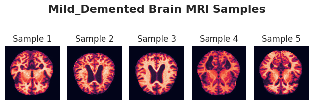
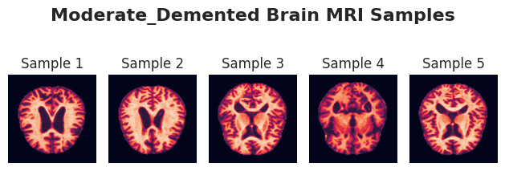
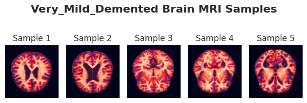
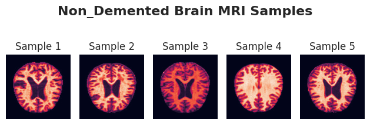

## Introduction
An early detection of Alzheimer’s disease provides an individual with a better chance of benefiting from treatment. The rapid and accurate determination of Alzheimer’s disease (AD) based on structural MRI has triggered significant interest among researchers, owing to an incremental amount of recent studies being driven by deep learning techniques that have achieved state-of-the-art performance in various fields, including medical image processing.

According to Alzheimer’s Association, AD is the incurable and 6th leading cause of death in United States and expected to become 4 times as of now by the end of 2050. The main purpose why I chose the project is that AD is one of the most complicated problems that medical officials face. The neurologist has to scan the MRI images and decide whether the patient has AD. It is quite possible that due to human error, there could be cases where early detection could be missed that may lead to major problems eventually. This project will use deep learning techniques such as CNN to build a model that detects the classification of the disease into stages where early and mild symptomatic patients may have chances to get treated. In order to detect AD accurately and at early stage deep learning techniques can be used. Deep learning techniques include many techniques such as CNN, RNN, and many more.

CNN is predominantly popular and gives more precise results according to the research. Why?

- The goal is to identify different stages of Alzheimer’s disease and obtain superior performance for early stage diagnosis.
- Deep learning technique like CNN gives higher segmentation precision, compared to other algorithms.
- CNNs are predominantly employed for the analysis of image data based on their ability to handle large data and to extract important features automatically.
- CNN can be used to classify AD patients and identify different stages of AD.

## Objective
The primary objective of this project is to build and evaluate deep learning models capable of accurately classifying MRI brain images into different stages of Alzheimer's disease: Mild Demented, Moderate Demented, Non Demented, and Very Mild Demented.

## Dataset
The dataset used in this project consists of MRI brain images collected from individuals at various stages of Alzheimer's disease. It includes images labeled with the corresponding disease stage, allowing for supervised learning.

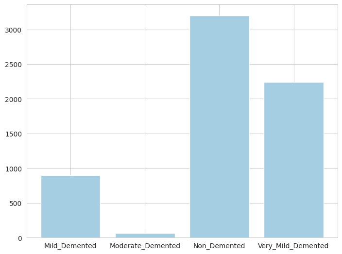

The Dataset has four classes of images:
- Class 1: Mild Demented (896 images)
- Class 2: Moderate Demented (64 images)
- Class 3: Non Demented (3200 images)
- Class 4: Very Mild Demented (2240 images)

## Technologies Used
- Python
- TensorFlow
- Keras
- Scikit-learn
- Pandas
- NumPy
- Matplotlib
- Seaborn
- OpenCV

## Solution Approach
### Data Collection and Preprocessing
Pre-processed MRI images are collected from the Kaggle dataset and resized to a standard size of 128x128 pixels for uniformity.

### Feature Extraction
Convolutional Neural Networks (CNNs) are employed for feature extraction, allowing the model to automatically learn and identify relevant patterns indicative of AD.

### Model Selection
Several CNN architectures are explored for AD detection, including:
- Basic CNN
- 3-layer CNN
- 4-layer CNN
- 5-layer CNN

## Results and Conclusion

### Model Evaluation Results

#### Training and Validation Accuracy

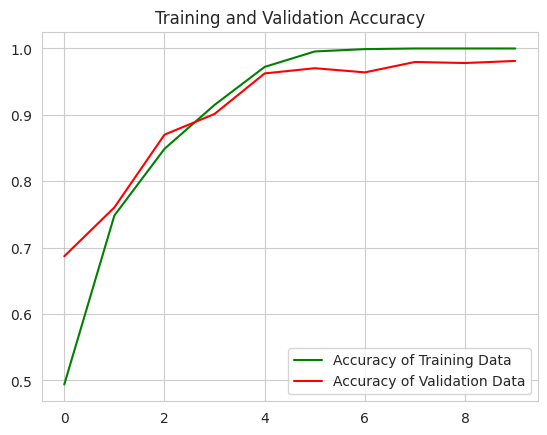

#### Training and Validation Loss

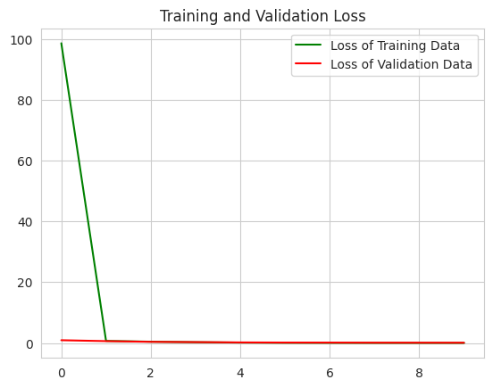

#### Training Data Accuracy and Loss

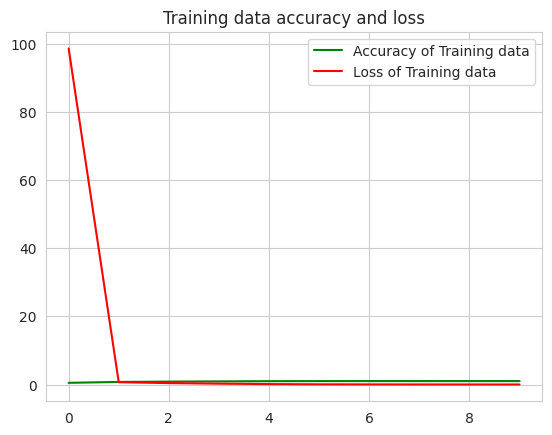

### Base Model Output

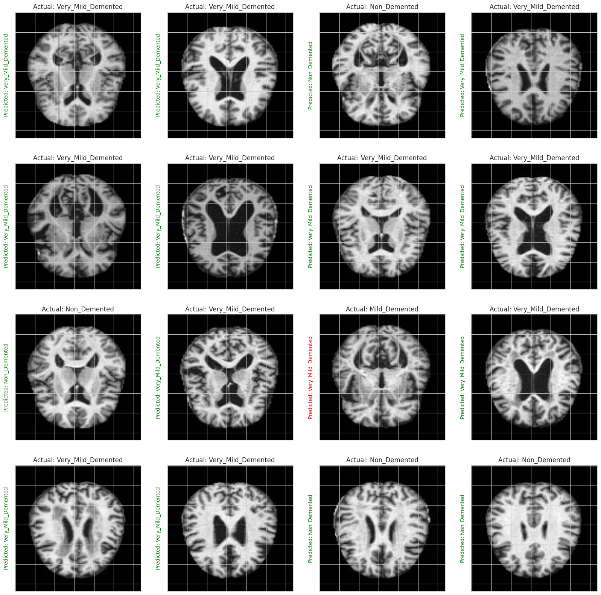

### Output from 3-layer CNN Model

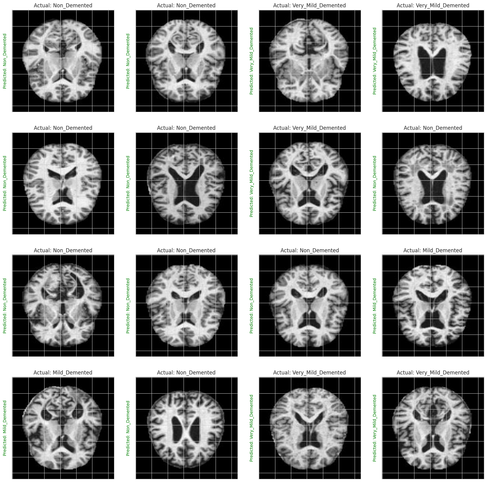

### Output from 4-layer CNN Model

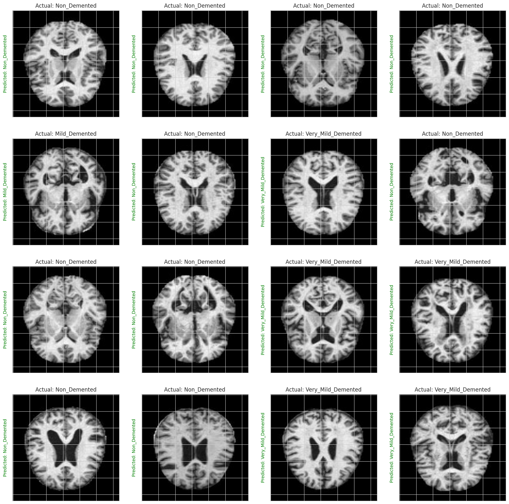

### Output from 5-layer CNN Model

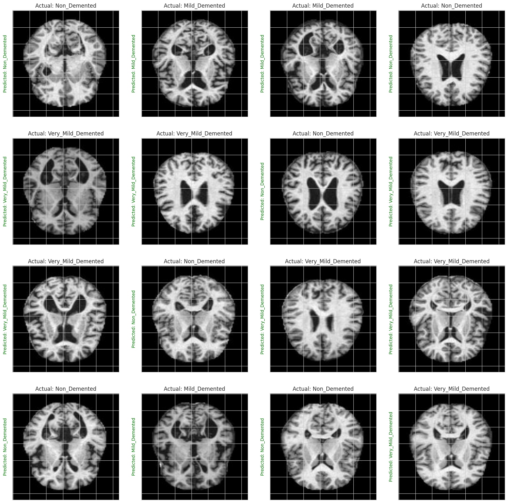

Below is the comparison of validation accuracy and test accuracy for each model:
| Sr. No. | Model Name     | Validation Accuracy | Test Accuracy |
|---------|----------------|---------------------|---------------|
| 1.      | Base model CNN | 98.12%              | 97.66%        |
| 2.      | 3-layer CNN    | 99.37%              | 98.13%        |
| 3.      | 4-layer CNN    | 99.37%              | 98.75%        |
| 4.      | 5-layer CNN    | 99.06%              | 98.60%        |

The successful implementation of various CNN models for Alzheimer's disease detection underscores the potential of deep learning techniques in medical imaging. The high accuracy achieved by these models, particularly the 4-layer CNN, showcases their ability to assist medical professionals in early diagnosis and treatment planning for Alzheimer's disease.

Continuous refinement and validation of such models are crucial for their eventual integration into clinical settings, ensuring reliability and trustworthiness in real-world diagnostic applications. As technology progresses and datasets expand, further enhancement and optimization of CNN-based models hold promise for even greater accuracy and reliability in Alzheimer's disease detection. 

This project highlights the importance of leveraging machine learning and deep neural networks in medical research to address complex healthcare challenges.

## Contributors
- [Apporva Agarwal](https://github.com/Apoorva-Agarwal): Project Lead

